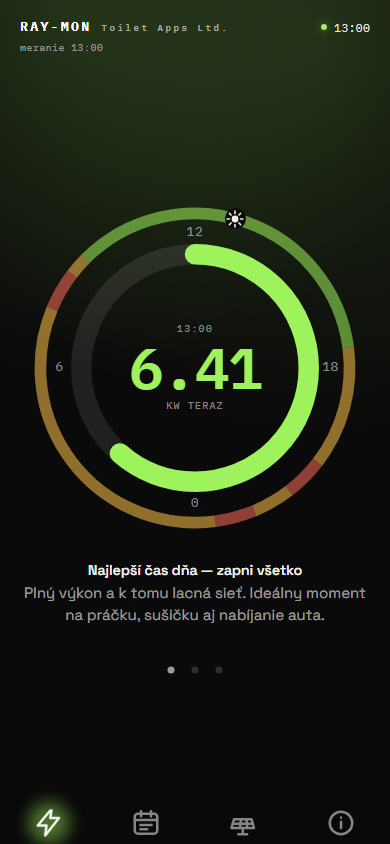
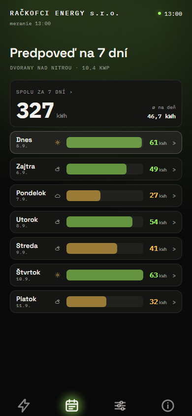
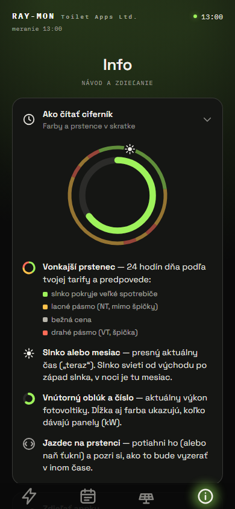

# RAY-MON

Webová appka pre domácnosť s fotovoltikou – pôvodne pre Dvorany nad Nitrou, dnes pre
kohokoľvek, kto si v Nastavení zadá svoju elektráreň. Na jednej obrazovke
odpovedá na otázku „môžem teraz zapnúť práčku?“ a k tomu ukazuje živý výkon panelov,
predpoveď výroby na dnes a zajtra a prehľad na sedem dní. Robená je pre telefón, na
tablete a desktope má vlastné rozloženie.

Appka je statická stránka bez build kroku. Beží na GitHub Pages, predpoveď si počíta sama
z Open-Meteo a živé meranie jej sprostredkuje Cloudflare Worker.

## Čo appka ukazuje

Spodná navigácia má len ikony bez textu – mená kariet nižšie slúžia len na orientáciu
v tomto popise.

|                Terazky                 |               7 dní               |               Info               |
| :------------------------------------: | :-------------------------------: | :------------------------------: |
|  |  |  |

Snímky sú z testovacích dát a pevného času (13:00), nie zo živej elektrárne – čísla na nich
sú syntetické. Prekresliť ich vie `npm run screenshots`. Karta Nastavenie na obrázku nie je
a položka Zdieľať appku na karte Info ostáva zavretá – QR kód v nej kreslí knižnica z CDN.

- **Terazky** – aktuálny výkon na ciferníku a pod ním pás odporúčaní: jednovetné
  odporúčanie („Najlepší čas dňa — zapni všetko“), stav piatich spotrebičov, predpoveď dňa
  a prípadne čas, kedy bude lepšie. Listuje sa potiahnutím do strán alebo klikom na bodky;
  poradie má konce – na prvej správe sa dá ísť len ďalej, na poslednej len späť.
  Ciferník sa číta aj ako 24-hodinový: vonkajší prstenec je plán dňa – cena elektriny podľa
  tarify (oranžová lacné pásmo, sivá bežná cena, červená drahé) a zelená tam, kde predpoveď
  sľubuje dosť slnka na veľké spotrebiče. Značka „teraz“ na ňom je slnko, v noci mesiac. Potiahnutím jazdca po prstenci alebo ťuknutím
  naň si pozrieš, ako to bude vyzerať v inom čase. Čo prstence a farby znamenajú, vysvetľuje
  karta Info.
- **7 dní** – prehľad dní: na telefóne rebríček, kde má každý deň pásik dlhý podľa výroby
  voči najsilnejšiemu dňu v týždni, a nad ním jediné veľké číslo za celý týždeň; na širokej
  obrazovke bubliny (Dnes, Zajtra, 7 dní spolu) a tabuľka so všetkými stĺpcami. Klik otvorí
  detail: na deň jeho priebeh výroby s oblačnosťou, čísla dňa (špička, využitie, oblačnosť),
  jeho riadok z mapy výroby a hlášku o tom dni; pri dnešku je v grafe aj skutočná nameraná
  krivka so značkou „teraz“ a koľko už z predpovede nabehlo. Klik na bublinu „Spolu za 7 dní“
  (na širokej obrazovke na bublinu „7 dní spolu“) otvorí detail celého týždňa: dennú výrobu,
  mapu výroby hodina × deň a hlášku o najsilnejšom dni. Na širokej obrazovke je vidno všetko
  naraz.
- **Nastavenie** – moja elektráreň. Kým si ju človek neuloží, appka ukazuje ukážku
  vymyslenej elektrárne v Londýne a karta ponúka **sprievodcu**: šesť krokov s jednou
  otázkou na obrazovku a ukazovateľom postupu. Poloha kdekoľvek na svete (vyhľadávanie
  alebo ručné súradnice, potvrdí ju dnešný východ a západ slnka), výkon panelu podľa štítku
  alebo len celkový výkon zo zmluvy, jedna až tri plochy panelov (smer na kompase s dráhou
  slnka, sklon podľa typu strechy, počet panelov ako mriežka), menič, nepovinne odkaz na
  kiosk Huawei FusionSolar pre živé meranie a na koniec zhrnutie s výrobou za jasného
  dneška. Na čo človek nevie odpoveď, preskočí tlačidlom „Neviem“. Po uložení je karta
  prehľad elektrárne a ťuknutie na riadok otvorí len jeho krok. Tlačidlo Späť na telefóne
  vracia v sprievodcovi o obrazovku. Nastavenie sa ukladá len v prehliadači.
- **Info** – zoznam položiek v rovnakom dizajne ako Nastavenie. **Ako čítať ciferník**:
  návod k ciferníku z karty Terazky, teda ilustračný ciferník a štyri vysvetlivky
  (vonkajší prstenec s cenou a slnkom, značka „teraz“, vnútorný oblúk výkonu,
  jazdec na prstenci). Obsah je statický, appka ho neprepočítava. **Zdieľať appku**: QR kód,
  odkaz na appku a tlačidlo na poslanie cez WhatsApp. K odkazu sa dá pribaliť vlastné
  nastavenie elektrárne, voliteľne aj s kiosk odkazom. Kto taký odkaz otvorí (alebo ho
  prilepí do Nastavenia), dostane ponuku nastavenie prevziať; appka ho bez potvrdenia neuloží.
  Nastavenie nesie aj adresa v prehliadači, takže appka pridaná na plochu iPhonu (ktorá
  úložisko Safari nevidí) ho pri prvom spustení ponúkne prevziať tiež.

Medzi kartami sa dá na dotykovej obrazovke prechádzať aj potiahnutím prsta do strán, v
poradí spodnej navigácie – aj ponad grafy a prehľad dní. V detaile dňa listuje to isté
gesto dni v týždni, nie karty: doľava na ďalší deň, doprava na predchádzajúci – a nový deň
sa prisunie z tej strany, ktorou si ťahal, rovnako ako karta pri prepnutí. Nezacyklí sa
– za posledným dňom už ťah nevedie nikam a z prvého dňa (Dnes) sa ťahom doprava vrátiš do
prehľadu dní, teda tam, kam vedie aj šípka späť v hlavičke detailu. V detaile týždňa je to
to isté: doľava sa nedeje nič, doprava zavrie detail. Nad grafom
listuje rýchle švihnutie a tooltip sa pri ňom vôbec neukáže; pomalé ťahanie po krivke ostáva
prezeraním s tooltipom ako doteraz. Zvislý ťah je posúvanie stránky – aj keď prst začne na grafe – a
tooltip sa pri ňom neukáže tiež. Nová karta sa pritom prisunie z tej strany, ktorou si listoval –
rovnako pri ťahaní aj pri kliku na navigáciu. Kto má v systéme zapnutý útlm pohybu, dostane
prepnutie bez animácie. Ťahanie si pre seba
nechávajú len veci, ktoré sa samy posúvajú do strán: pás odporúčaní na karte Terazky – ten
si ho necháva aj na krajnej správe, takže ťah v ňom nikdy neopustí kartu – a jazdec na prstenci
ciferníka, ktorý sa ťahá a kartu neprepne.

Systémové tlačidlo Späť na telefóne a tablete (a šípka v prehliadači) vracia o krok späť
v appke: najprv zavrie detail dňa, potom sa vracia po kartách v opačnom poradí, než si
nimi prešiel. Dopredu vedie tá istá cesta naspäť. Výber vnútri karty – vybraný deň
alebo stránka pásu odporúčaní – krok navigácie nie je, na ten sa Späť nevracia.
Keď sa kroky minú, ďalšie Späť z appky odíde; v nainštalovanej appke (PWA) to znamená jej
zatvorenie. Zatvorenie sa nikde nevynucuje dvojitým stlačením – to je zvyk natívnych
androidových appiek, nie webu, a stránka sa sama zavrieť ani nevie. Adresa sa pritom
nemení, takže odkaz na appku ostáva jeden.

## Ako to funguje

```
Open-Meteo (žiarenie) ──────────────────────────────→ appka počíta predpoveď
Huawei FusionSolar kiosk ─→ Cloudflare Worker ─────→ appka (živé meranie)
```

Appka si pre lokalitu z karty Nastavenie stiahne z Open-Meteo hodinové žiarenie, teplotu
a oblačnosť a sama z nich dopočíta predpoveď výroby: polohu slnka, žiarenie na roviny
panelov, teplotný odber a limit meniča. Tá istá funkcia počíta aj strop pri úplne jasnej
oblohe, z ktorého vychádza údaj „využitie“. Počasie sa sťahuje najviac raz za hodinu.

Živé meranie je nepovinné. Kto si v Nastavení vloží odkaz na verejný kiosk svojej
elektrárne z Huawei FusionSolar, tomu ho appka každú minútu stiahne cez Worker (prehliadač
sa na kiosk priamo nedostane). Odkaz ostáva uložený len v prehliadači a Worker si ho nikam
neukladá. Bez odkazu appka ukazuje odhad z predpovede.

Keď nie je dostupné nič, appka ukáže „dáta nedostupné“ a nespadne.

## Štruktúra

| Priečinok                           | Čo obsahuje                                                                                                                                             |
| ----------------------------------- | ------------------------------------------------------------------------------------------------------------------------------------------------------- |
| `shared/`                           | Doménová logika bez vstupov a výstupov: konštanty, fyzika slnka, parser kiosku, tarifa, texty, modely grafov. Beží v prehliadači, v Node aj vo Workeri. |
| `web/`                              | Stav appky, načítanie dát, vykresľovanie po kartách, poslucháče udalostí, skladanie SVG.                                                                |
| `worker/`                           | Cloudflare Worker: jeden endpoint, ktorý stiahne kiosk FusionSolar.                                                                                     |
| `test/`                             | Jednotkové testy, kontrakt dát a end-to-end testy v prehliadači.                                                                                        |
| `index.html`, `style.css`, `app.js` | Samotná stránka. Žiadny bundler, žiadny framework.                                                                                                      |

Doménová logika je oddelená zámerne: to isté číslo sa nikdy nepočíta na dvoch miestach a
každá funkcia v `shared/` sa dá otestovať bez prehliadača.

## Vývoj

```bash
npm install
npm run serve     # http://127.0.0.1:8080
npm run check     # lint + formát + typy + testy
npm run test:e2e  # testy v prehliadači (Playwright)
```

Typy sa kontrolujú cez JSDoc a `tsc --checkJs`, takže v repozitári nie je ani jeden
TypeScript súbor a stránka sa nikam nekompiluje.

Testovacie dáta v `test/fixtures/` sú syntetické a deterministické, vygeneruje ich
`npm run fixtures`. Výstup predpovede je zamknutý súborom `test/golden/forecast.json`;
keď zmeníš výpočet zámerne, spusti `UPDATE_GOLDEN=1 npm test` a zmenu popíš v pull requeste.

## Nasadenie

Oboje je nasadené a beží.

- **Stránka**: GitHub Pages, _Deploy from a branch_, vetva `main`, priečinok `/ (root)`.
  Adresa: <https://rastislavsk.github.io/ray-mon/>
- **Stará adresa** `…/rackofci-energy-sro-fable/`: repozitár sa tak volal do premenovania
  na RAY-MON. GitHub Pages staré adresy neprevádza, preto na nej ostáva samostatný
  repozitár [`rackofci-energy-sro-fable`](https://github.com/rastislavsk/rackofci-energy-sro-fable)
  so stránkou, ktorá presmeruje na novú adresu aj s nastavením v odkaze. Drží pri živote
  uložené odkazy, QR kódy a ikony na ploche.
- **Worker** `ray-mon`: nasadzuje sa sám pri pushnutí do `main` cez
  Git integráciu Cloudflare. Postup a nastavenia buildu sú v
  [`worker/README.md`](worker/README.md).
