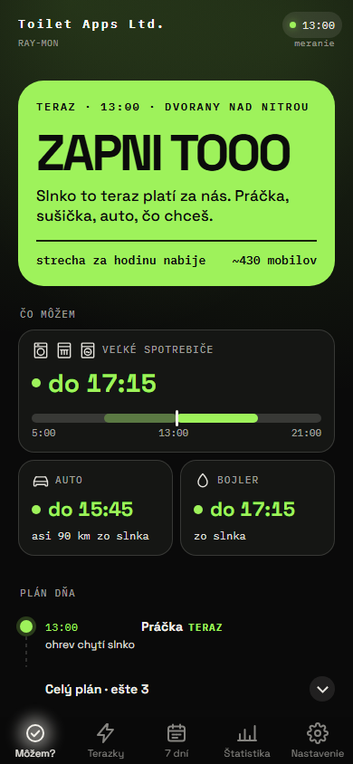
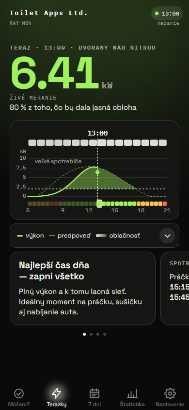
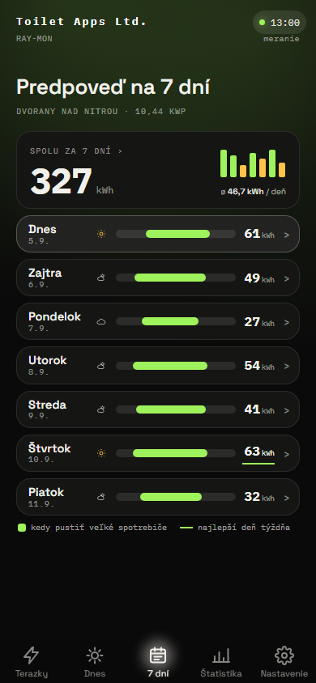
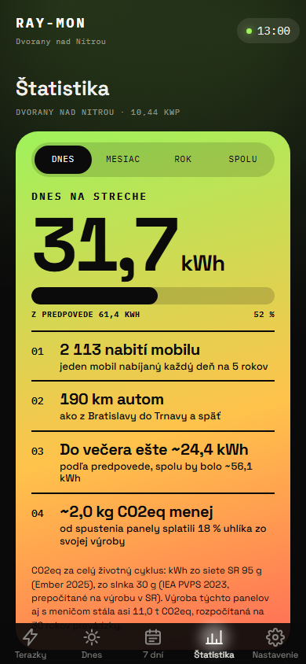
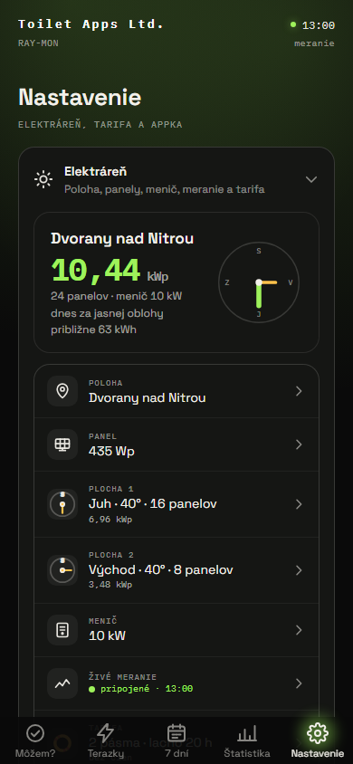

# RAY-MON

Webová appka pre domácnosť s fotovoltikou – pôvodne pre Dvorany nad Nitrou, dnes pre
kohokoľvek, kto si v Nastavení zadá svoju elektráreň. Na jednej obrazovke
odpovedá na otázku „môžem teraz zapnúť práčku?“ a k tomu ukazuje živý výkon panelov,
predpoveď výroby na dnes a zajtra a prehľad na sedem dní. Robená je pre telefón, na
tablete a desktope má vlastné rozloženie.

Appka je statická stránka bez build kroku. Beží na GitHub Pages, predpoveď si počíta sama
z Open-Meteo a živé meranie jej sprostredkuje Cloudflare Worker.

## Čo appka ukazuje

Spodná navigácia má pod každou ikonou meno karty (na desktope je meno vedľa ikony).

|               Môžem?                |                Terazky                 |               7 dní               |                  Štatistika                  |                  Nastavenie                  |
| :---------------------------------: | :------------------------------------: | :-------------------------------: | :------------------------------------------: | :------------------------------------------: |
|  |  |  |  |  |

Snímky sú z testovacích dát a pevného času (13:00), nie zo živej elektrárne – čísla na nich
sú syntetické. Prekresliť ich vie `npm run screenshots`. Položky sekcie Appka
v karte Nastavenie ostávajú zavreté – QR kód v Zdieľať appku kreslí knižnica z CDN.

- **Môžem?** – odpoveď pre celú rodinu, nielen pre toho, kto sa vo fotovoltike vyzná. Hore jedno
  veľké slovo na plnej farbe (**ZAPNI TOOO**, **NO NO, NOT YET**, **NAHOVNO DEŇ**, **Dnes už ne e !**, **Neviem.**),
  jedna veta a jeden fakt v jednotkách, ktoré pozná každý (koľko mobilov strecha nabije za hodinu).
  Pod tým pás dneška s úsekom, keď slnko stačí na veľké spotrebiče, a riadok **Čo môžem**: koľko
  vecí ide hneď, farebná bodka za každú a výnimky slovom („5 zo 6 ide hneď · auto o 12:30“).
  Ťuknutie naň otvorí zoznam vecí – práčka, umývačka, sušička, auto, hranie a fén – s krátkou
  odpoveďou („do 15:30“, „o 10:30“, „zajtra 08:00“, „lacno“). Ťuknutie na vec ju rozbalí: čo robiť, prečo, a čo keď sa zamračí alebo to
  treba hneď – s cenou zo siete, keď ju tarifa pozná. Na konci karty je odkaz na **súhrn na zdieľanie**: posledných
  7 dní alebo mesiac na streche ako plagát – veľké číslo kWh, stĺpce dní (mesiac ako mriežka),
  nabitia mobilu, kilometre autom s porovnaním trasy, najlepší deň a hodnota podľa tarify. „Zdieľať do story“ z neho nakreslí obrázok 1080 × 1920 a pošle ho
  systémovému zdieľaniu telefónu (na desktope sa stiahne). Súhrn potrebuje živé meranie; dni si
  appka odkladá sama, deň, keď nebola otvorená, v stĺpcoch chýba a súhrn to povie. „Áno“ je tá istá zelená ako na páse plánu dňa na karte Terazky. Karta je v navigácii
  prvá a appka sa na nej otvára – každý telefón si to môže zmeniť v Nastavení.
- **Terazky** – rozloženie karty Teraz z novej appky vo farbách tejto: veľké číslo s aktuálnym
  výkonom (vo farbe plánu dňa), odkiaľ je a koľko z jasnej oblohy, pod ním graf dňa – hore oblačnosť
  po hodinách, krivka predpovede a nameraná krivka s osou kW, hranica veľkých spotrebičov s plochou
  nad ňou (slnko navyše na veľké spotrebiče), pás plánu po polhodinách (zelená slnko stačí, oranžová
  lacná sieť, červená drahá, sivá bežná cena; čo už prešlo, je stlmené) a pod ním okno „Zapni veľké“.
  Ťahom prstom alebo kurzorom po grafe (aj šípkami) si pozrieš iný čas, „Späť na teraz“ ho vráti.
  Pod grafom je pás štyroch kariet do strán: čo robiť teraz, spotrebiče s krátkou odpoveďou
  z karty Môžem?, dnešok (predpoveď, koľko už nabehlo, okno na veľké veci) a kedy bude lepšie.
  Na širokej obrazovke sú karty pod sebou vedľa grafu. Obsah počíta ten istý model ako nová appka.
- **7 dní** – prehľad dní: na telefóne rebríček, kde má každý deň pásik dlhý podľa výroby
  voči najsilnejšiemu dňu v týždni, a nad ním jediné veľké číslo za celý týždeň so stĺpčekmi
  dní v malom; pod rebríčkom legenda farieb (silný, priemerný, slabý deň); na širokej
  obrazovke bubliny (Dnes, Zajtra, 7 dní spolu) a tabuľka so všetkými stĺpcami. Klik otvorí
  detail: na deň okno na veľké spotrebiče (odkedy dokedy slnko stačí a pri dnešku, či už
  beží), časová os dňa – hore riadok heatmapy dňa (výroba po hodinách v tých istých farbách
  ako heatmapa týždňa), pod ním krivka oblačnosti a pás „zapni veľké / čiastočne / zo siete“
  z plánu dňa – tri čísla (predpoveď, oblačnosť alebo koľko už nabehlo, špička) a tlačidlá na
  susedné dni; pri dnešku je v grafe značka „teraz“. Na širokej obrazovke ostáva priebeh
  výroby krivkou s oblačnosťou a nameranou výrobou. Klik na bublinu „Spolu za 7 dní“
  (na širokej obrazovke na bublinu „7 dní spolu“) otvorí detail celého týždňa: dennú výrobu,
  mapu výroby hodina × deň a hlášku o najsilnejšom dni. Na širokej obrazovke je vidno všetko
  naraz.
- **Štatistika** – koľko elektráreň vyrobila dnes, tento mesiac, tento rok a od spustenia
  (prepínač obdobia, jedno veľké číslo a zvyšné obdobia v riadkoch pod ním) a akú hodnotu
  má tá elektrina podľa tarify, teda koľko by za ňu človek zaplatil zo siete. Dnešok sa
  oceňuje podľa pásiem z nameranej krivky, dlhšie obdobia (kiosk ich posiela len ako súčet)
  priemernou cenou podľa toho, do ktorých pásiem padá výroba z predpovede. Koľko elektriny
  domácnosť spotrebovala sama, appka nevie – kiosk hlási len výrobu – a karta to hovorí.
  Súčty posiela len živé meranie; bez neho karta ukáže dnešok podľa predpovede a ponúkne
  meranie pripojiť, bez cien ukáže len kWh a ponúkne ceny doplniť. Obe výzvy otvoria
  rovno ten krok v Nastavení.
- **Nastavenie** – moja elektráreň. Pri prvom otvorení sa appka spýta len na polohu; panely
  môže človek nastaviť hneď, alebo ich odložiť – vtedy karta 7 dní ukazuje predpoveď pre
  typickú strechu v jeho polohe a karty Terazky a Môžem? z nej odpovedajú, s jantárovým pásom,
  že je to odhad, a tlačidlom panely zadať.
  Karta ponúka **sprievodcu**: sedem krokov s jednou
  otázkou na obrazovku a ukazovateľom postupu. Poloha kdekoľvek na svete (vyhľadávanie
  alebo ručné súradnice, potvrdí ju dnešný východ a západ slnka), výkon panelu podľa štítku
  alebo len celkový výkon zo zmluvy, jedna až tri plochy panelov (smer na kompase s dráhou
  slnka, sklon podľa typu strechy, počet panelov ako mriežka), menič, nepovinne živé meranie
  (výber značky meniča a spôsobu pripojenia: kiosk alebo API účet od inštalatéra pri Huawei FusionSolar, kľúč Fox ESS či Solis, token SolaX či Victron, aplikácia Deye), tarifa a na koniec zhrnutie s výrobou za jasného
  dneška. Tarifa: jedna cena, dve pásma (VT/NT) alebo tri a viac; rozvrh dňa sa maľuje prstom
  po kruhu (alebo zadá po úsekoch), s výnimkou pre víkend či časť roka a nepovinne s cenami,
  podľa ktorých appka sama určí, ktoré pásmo je lacné a ktoré drahé. Na čo človek nevie odpoveď, preskočí tlačidlom „Neviem“. Po uložení je
  v karte rozbaľovacia položka **Elektráreň** s prehľadom: karta s menom, celkovým výkonom,
  zostavou a kompasom plôch a pod ňou riadky, z ktorých ťuknutie otvorí len jeho krok. Tlačidlo
  Späť na telefóne vracia v sprievodcovi o obrazovku. Nastavenie sa ukladá len v prehliadači.
  Pod elektrárňou je sekcia **Appka** (kedysi samostatná karta Info). Položka **Úvodná karta**
  určuje, na ktorej karte sa appka otvára (Môžem? alebo Terazky). Je to voľba telefónu, nie
  elektrárne, a ukladá sa zvlášť. **Zdieľať appku**: QR kód,
  odkaz na appku a tlačidlo na poslanie cez WhatsApp. K odkazu sa dá pribaliť vlastné
  nastavenie elektrárne, voliteľne aj so živým meraním. Kto taký odkaz otvorí (alebo ho
  prilepí do Nastavenia), dostane ponuku nastavenie prevziať; appka ho bez potvrdenia neuloží.
  Nastavenie nesie aj adresa v prehliadači, takže appka pridaná na plochu iPhonu (ktorá
  úložisko Safari nevidí) ho pri prvom spustení ponúkne prevziať tiež.

Karty sa prepínajú ťuknutím v spodnej navigácii; ťah prstom do strán ich neprelistuje. Ťahom sa
listujú dni v detaile dňa na karte 7 dní: obsah ide za prstom a vedľa neho už vidno susedný deň,
po pustení dobehne na nový deň (za tretinou šírky alebo pri rýchlom švihnutí), inak sa vráti. Na
Dnes a na poslednom dni sa pás len poddá. Nad detailom je riadok so šípkou späť do prehľadu a
čipmi dní – ťuknutie na čip, tlačidlá susedných dní dole aj šípky na klávesnici listujú tým istým
pohybom. Nadpis dňa nesie ikonu oblohy a pod ním slovo (jasno, polojasno, zamračené) – v oboch
appkách rovnako. Po prelistovaní čítačka ohlási deň a jeho poradie. Kto má v systéme zapnutý útlm
pohybu, dostane prelistovanie bez dojazdu. Nad grafom stĺpcov v detaile týždňa je pomalé ťahanie
prezeraním s tooltipom, rýchle švihnutie ho ani neukáže. Zvislý ťah je posúvanie stránky – aj keď
prst začne na grafe – a tooltip sa pri ňom neukáže tiež.

Systémové tlačidlo Späť na telefóne a tablete (a šípka v prehliadači) vracia o krok späť
v appke: najprv zavrie detail dňa, potom sa vracia po kartách v opačnom poradí, než si
nimi prešiel. Dopredu vedie tá istá cesta naspäť. Výber vnútri karty – vybraný deň
alebo stránka pásu odporúčaní – krok navigácie nie je, na ten sa Späť nevracia.
Keď sa kroky minú, ďalšie Späť z appky odíde; v nainštalovanej appke (PWA) to znamená jej
zatvorenie. Zatvorenie sa nikde nevynucuje dvojitým stlačením – to je zvyk natívnych
androidových appiek, nie webu, a stránka sa sama zavrieť ani nevie. Adresa sa pritom
nemení, takže odkaz na appku ostáva jeden.

## Druhý vzhľad „Živá obloha“

V priečinku `obloha/` je druhá appka podľa návrhu
[`docs/navrhy/smer-b-obloha.html`](docs/navrhy/smer-b-obloha.html) (smer B; otvor ho v prehliadači,
je klikací), na <https://rastislavsk.github.io/ray-mon/obloha/>. Pozadie je obloha podľa času dňa,
skutočného východu a západu slnka v polohe elektrárne a oblačnosti z predpovede. Má tie isté karty
ako súčasná appka, každú po svojom.

Obe appky ostávajú natrvalo: jedno jadro, dva kabáty
([`docs/navrhy/jedno-jadro-dva-kabaty.html`](docs/navrhy/jedno-jadro-dva-kabaty.html)). Počítajú
tým istým kódom (`shared/`, časť `web/`), berú dáta z toho istého Workera a čítajú to isté uložené
nastavenie – čo si človek nastaví v jednej, vidí aj v druhej. Líšia sa obrazovkami, nie odpoveďami.

## Ako to funguje

```
Open-Meteo (žiarenie) ──────────────────────────────→ appka počíta predpoveď
výrobca meniča (kiosk) ──→ Cloudflare Worker ─────→ appka (živé meranie)
```

Appka si pre lokalitu z karty Nastavenie stiahne z Open-Meteo hodinové žiarenie, teplotu
a oblačnosť a sama z nich dopočíta predpoveď výroby: polohu slnka, žiarenie na roviny
panelov, teplotný odber a limit meniča. Tá istá funkcia počíta aj strop pri úplne jasnej
oblohe, z ktorého vychádza údaj „využitie“. Počasie sa sťahuje najviac raz za hodinu.

Živé meranie je nepovinné. Kto si v Nastavení pripojí menič (vyberie značku a spôsob – odkaz na kiosk
Huawei FusionSolar, kľúč z Fox ESS, token zo SolaX alebo Victron), tomu appka stiahne meranie cez Worker
(každú minútu, pri značkách s prísnejšími limitmi či pomalším cloudom zriedkavejšie)
(prehliadač sa k výrobcovi priamo nedostane). Telefón drží prístup len zapečatený – otvoriť ho
vie iba Worker, a ten si nič neukladá. Bez merania appka ukazuje odhad z predpovede.

Keď nie je dostupné nič, appka ukáže „dáta nedostupné“ a nespadne.

## Štruktúra

| Priečinok                                      | Čo obsahuje                                                                                                                                             |
| ---------------------------------------------- | ------------------------------------------------------------------------------------------------------------------------------------------------------- |
| `shared/`                                      | Doménová logika bez vstupov a výstupov: konštanty, fyzika slnka, parser kiosku, tarifa, texty, modely grafov. Beží v prehliadači, v Node aj vo Workeri. |
| `web/`                                         | Stav appky, načítanie dát, vykresľovanie po kartách, poslucháče udalostí, skladanie SVG.                                                                |
| `obloha/`                                      | Druhá appka „Živá obloha“ vedľa súčasnej. Vlastná stránka a stav, výpočty a dáta zo `shared/` a `web/`.                                                 |
| `worker/`                                      | Cloudflare Worker: jeden endpoint, ktorý stiahne kiosk FusionSolar.                                                                                     |
| `test/`                                        | Jednotkové testy, kontrakt dát a end-to-end testy v prehliadači.                                                                                        |
| `index.html`, `style.css`, `boot.js`, `app.js` | Samotná stránka. Žiadny bundler, žiadny framework.                                                                                                      |

Doménová logika je oddelená zámerne: to isté číslo sa nikdy nepočíta na dvoch miestach a
každá funkcia v `shared/` sa dá otestovať bez prehliadača.

## Vývoj

```bash
npm install
npm run serve     # http://127.0.0.1:8080
npm run check     # lint + formát + typy + testy
npm run test:e2e  # testy v prehliadači (Playwright)
```

Typy sa kontrolujú cez JSDoc a `tsc --checkJs`, takže v repozitári nie je ani jeden
TypeScript súbor a stránka sa nikam nekompiluje.

Testovacie dáta v `test/fixtures/` sú syntetické a deterministické, vygeneruje ich
`npm run fixtures`. Výstup predpovede je zamknutý súborom `test/golden/forecast.json`;
keď zmeníš výpočet zámerne, spusti `UPDATE_GOLDEN=1 npm test` a zmenu popíš v pull requeste.

## Nasadenie

Oboje je nasadené a beží.

- **Stránka**: GitHub Pages, _Deploy from a branch_, vetva `main`, priečinok `/ (root)`.
  Adresa: <https://rastislavsk.github.io/ray-mon/>
- **Stará adresa** `…/rackofci-energy-sro-fable/`: repozitár sa tak volal do premenovania
  na RAY-MON. GitHub Pages staré adresy neprevádza, preto na nej ostáva samostatný
  repozitár [`rackofci-energy-sro-fable`](https://github.com/rastislavsk/rackofci-energy-sro-fable)
  so stránkou, ktorá presmeruje na novú adresu aj s nastavením v odkaze. Drží pri živote
  uložené odkazy, QR kódy a ikony na ploche.
- **Worker** `ray-mon`: nasadzuje sa sám pri pushnutí do `main` cez
  Git integráciu Cloudflare. Postup a nastavenia buildu sú v
  [`worker/README.md`](worker/README.md).
